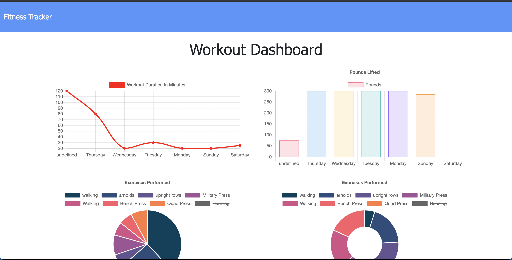

# Mongo-workout-tracker

Fullstack web app that allows you to track both cardio and resistance type workouts on a daily basis. Workout totals including duration, reps, distance, etc. are provided as exercises are added and completed with exercise data being stored in a Mongo dB. A stats view is provided to allow you see progress over the last 7 days for workout duration (minutes), weight lifted (pounds), exercised count completed per day. Mongo DB with an express server in node.js is used to persist data while mongoose is used as an ODM for data modelling.
    
- [Installation](#installation)
- [Usage](#usage)
- [License](#license)
- [Contributions](#contributions)
- [Tests](#test)
- [Questions](#questions)
    
## Installation
    
1. Clone my app repo to your local machine: https://github.com/204039643/Mongo-workout-tracker
2. Navigate to the main folder which contains server.js file and run NPM Install.
3. If you haven't done so already, install Mongo DB, start Mongo server, and instantiate a new DB called 'workouts'.
4. Run 'NPM run seeds' in CLI to seed DB with 9 default records. This will help demo functionality and you can always remove later and replace with your own data.
5. Type NPM start app, instantiate express server, and access Mongo dB.
6. Navigate to localhost:3002 in your browser to use app locally.
    
## Usage
    
1. Open deployed in your favorite browser: HEROKU
    
## License
    
MIT
    
Copyright (c) [2021] Justin Sykes
    
Permission is hereby granted, free of charge, to any person obtaining a copy
of this software and associated documentation files (the "Software"), to deal
in the Software without restriction, including without limitation the rights
to use, copy, modify, merge, publish, distribute, sublicense, and/or sell
copies of the Software, and to permit persons to whom the Software is
furnished to do so, subject to the following conditions:
    
The above copyright notice and this permission notice shall be included in all
copies or substantial portions of the Software.
    
THE SOFTWARE IS PROVIDED "AS IS", WITHOUT WARRANTY OF ANY KIND, EXPRESS OR
IMPLIED, INCLUDING BUT NOT LIMITED TO THE WARRANTIES OF MERCHANTABILITY,
FITNESS FOR A PARTICULAR PURPOSE AND NONINFRINGEMENT. IN NO EVENT SHALL THE
AUTHORS OR COPYRIGHT HOLDERS BE LIABLE FOR ANY CLAIM, DAMAGES OR OTHER
LIABILITY, WHETHER IN AN ACTION OF CONTRACT, TORT OR OTHERWISE, ARISING FROM,
OUT OF OR IN CONNECTION WITH THE SOFTWARE OR THE USE OR OTHER DEALINGS IN THE
SOFTWARE.
    
## Contributions
    
- Jquery (https://www.jquery.com)
- NPM packages: express (https://www.npmjs.com/package/express), morgan (https://www.npmjs.com/package/morgan), mongoose (https://www.npmjs.com/package/mongoose), path
- Heroku (www.heroku.com)
    
## Tests
    
None
    
## Questions?
Please reach out to me at either of the following:
GitHub username: 204039643
Email: atlsykes1@att.net
    
    
 ---This README was generated using nice-readme-generator :-) ---